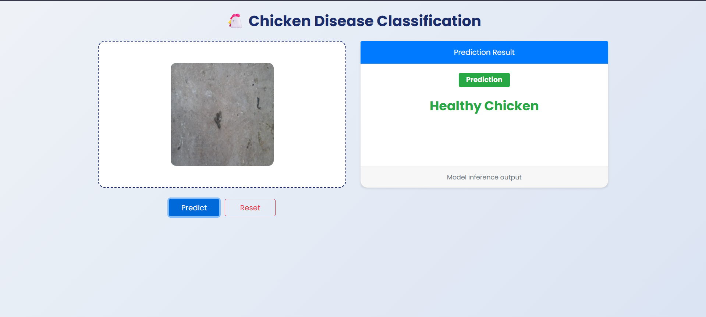
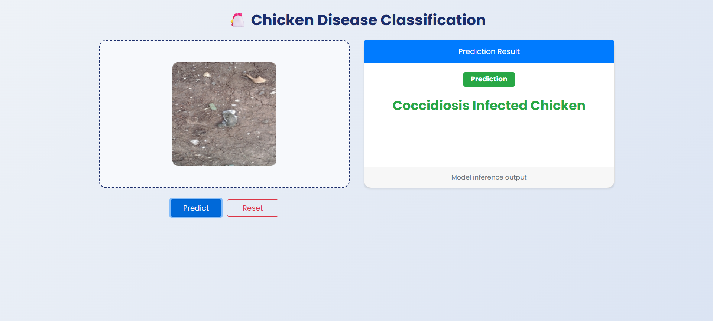

# 🐔 Coccidiosis Disease Classification (Deep Learning + MLOps)

An end-to-end **Deep Learning and MLOps** project for **chicken disease classification** using **CNN-based transfer learning (VGG16)** and **reproducible ML pipelines with DVC**.

This project focuses on **real-world ML engineering practices**, including pipeline modularization, artifact management, and training–inference consistency.

---

## 🚀 Project Overview

Coccidiosis is a common poultry disease that can be identified through fecal image analysis.  
This project builds an automated image classification system that:

- Trains a CNN using transfer learning
- Tracks data, models, and metrics using DVC
- Ensures reproducible experimentation
- Provides a simple web interface for image-based inference

---

## 🧠 Key Features

- ✅ Transfer Learning using **VGG16 (ImageNet weights)**
- ✅ ~**96% validation accuracy**
- ✅ **DVC pipelines** for reproducible ML workflows
- ✅ Modular pipeline design (ingestion → training → evaluation → prediction)
- ✅ Consistent preprocessing between training and inference
- ✅ Lightweight web UI for predictions

---

## 🏗 Project Workflow

```
Data Ingestion
      ↓
Prepare Base Model (VGG16)
      ↓
Model Training
      ↓
Model Evaluation
      ↓
Prediction via Web App
```

---

## 📂 Project Structure

```
├── artifacts/                # Tracked outputs (data, models, metrics)
├── config/                   # Configuration files
├── params.yaml               # Hyperparameters tracked by DVC
├── src/cnnClassifier/        # Source code
│   ├── components/           # Core ML components
│   ├── pipeline/             # DVC pipeline stages
│   └── utils/                # Helper utilities
├── app.py                    # Web application entry point
├── dvc.yaml                  # DVC pipeline definition
└── README.md
```

---

## ⚙️ Tech Stack

- Python
- TensorFlow / Keras
- CNNs (VGG16 Transfer Learning)
- DVC (Pipelines & Versioning)
- HTML / CSS / JavaScript

---

## 📊 Results

| Metric | Value |
|------|------|
| Validation Accuracy | ~96% |
| Validation Loss | ~0.12 |
| Classes | Healthy / Coccidiosis Infected |

---

## 🔍 Prediction Examples

### Healthy Chicken


### Coccidiosis Infected Chicken


---

## 🔁 Reproducible Training with DVC

```bash
dvc repro
```

```bash
dvc dag
```

---

## ▶️ How to Run the Project

### Clone the repository
```bash
git clone https://github.com/ayush190511/Coccidiosis-chicken-disease-classification
cd Coccidiosis-chicken-disease-classification
```

### Create environment
```bash
conda create -n chicken python=3.9 -y
conda activate chicken
```

### Install dependencies
```bash
pip install -r requirements.txt
```

### Run app
```bash
python app.py
```

Open browser at:
```
http://localhost:8080
```

---

## 🔗 GitHub Repository

https://github.com/ayush190511/Coccidiosis-chicken-disease-classification
